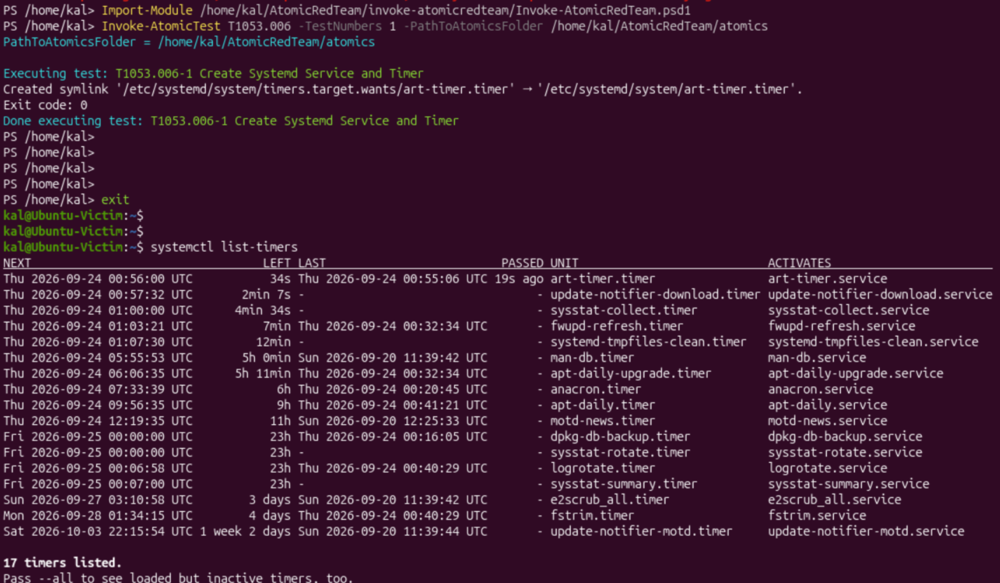
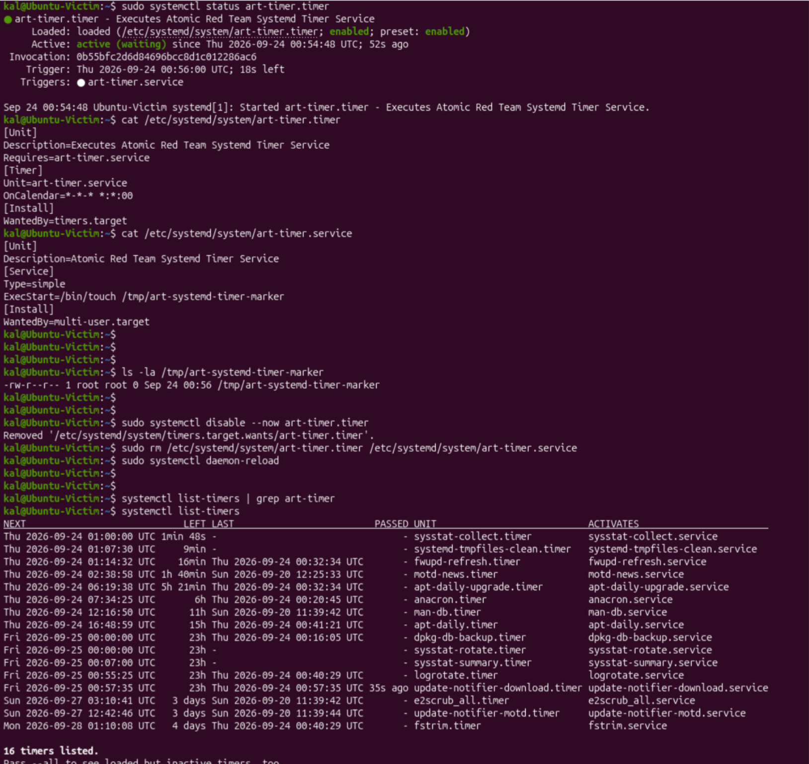

## Incident Report: T1053.006 - Scheduled Task/Job: Systemd Timers

**Environment:** Ubuntu Server 26.04.1 LTS (ARM64), isolated VirtualBox lab VM (Ubuntu-Victim)
**Date:** 25 September 2026
**Simulated by:** Invoke-AtomicRedTeam (Atomic Test T1053.006)

### Summary

Investigated a persistence mechanism established via a malicious systemd timer and
its paired service unit, discovered through baseline comparison of active
timers/services, analysed, and remediated using native `systemctl` commands.

### Technique

T1053.006: Scheduled Task/Job - Systemd Timers (Persistence / Privilege Escalation).
systemd timer units (`.timer`) can be paired with a service unit (`.service`) to
execute a program on a schedule, functioning as a Linux-native analog to cron or
Windows Scheduled Tasks. An attacker can use a timer to establish persistent, recurring
execution of malicious code.

### Detection

A baseline of active timers and loaded units was captured before the technique
executed. After running the Atomic test, the timer list and unit files were checked
again. The new unit `art-timer.timer` (paired with `art-timer.service`) appeared,
confirmed via:

```
systemctl list-timers
systemctl status art-timer.timer
systemctl status art-timer.service
```

Execution of the paired service was confirmed by the presence of a marker file:

```
/tmp/art-systemd-timer-marker
```



### Analysis

- **Naming/location:** the unit files were not part of the distribution's default set
  of installed timers and were introduced immediately after test execution, which is
  what the before/after comparison surfaced.
- **Behaviour:** the service's `ExecStart` directive pointed to a command that wrote a
  marker file to `/tmp`, consistent with a lightweight persistence mechanism designed
  to repeatedly execute attacker-controlled logic without further interaction.
- **Recurrence:** the timer's schedule meant the service would continue firing
  indefinitely until removed, which is the core persistence property being
  demonstrated.

### Eradication

```
sudo systemctl disable --now art-timer.timer
sudo rm /etc/systemd/system/art-timer.timer /etc/systemd/system/art-timer.service
sudo systemctl daemon-reload
```

Manual, real-world remediation commands were used: disabling and stopping the timer,
removing both unit files, and reloading the systemd daemon so the removed units are no
longer recognised.

### Verification

```
systemctl list-timers | grep art-timer
systemctl status art-timer.timer
```

Output confirmed the unit no longer exists (`Unit art-timer.timer could not be found`),
and the timer no longer appears in the active timer list.



### MITRE ATT&CK Context / Conclusion

This exercise demonstrates detection of a systemd-timer-based persistence mechanism
through unit-file baseline comparison, rather than prior knowledge of the unit's name,
along with full manual eradication and verification using native systemd tooling.
