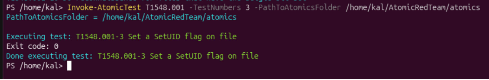
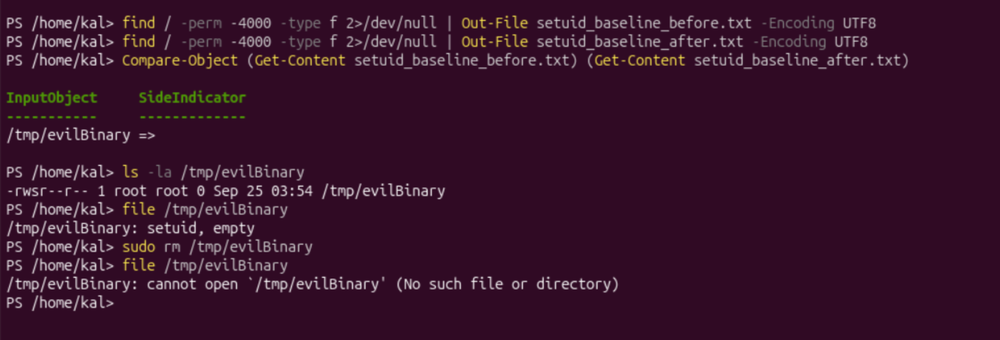

## Incident Report: T1548.001 - Abuse Elevation Control Mechanism (SetUID/SetGID)

**Environment:** Ubuntu Server 26.04.1 LTS (ARM64), isolated VirtualBox lab VM (Ubuntu-Victim)
**Date:** 25 September 2026
**Simulated by:** Invoke-AtomicRedTeam (Atomic Test T1548.001-3, "Set a SetUID flag on file")

### Summary

Investigated a suspicious SetUID-flagged file on a Linux host, identified through a
full system baseline comparison rather than a known filename, analysed on
name-independent technical criteria, and remediated with a genuine manual removal
command.

### Technique

T1548.001: Abuse Elevation Control Mechanism - Setuid and Setgid (Privilege Escalation
/ Defense Evasion). The SetUID permission bit causes an executable to run with the
privileges of its file owner, rather than the invoking user. If the file is owned by
root, an eligible user executing the file can temporarily gain root-level privileges.

### Detection

A system-wide baseline of all SetUID-flagged files was captured before the technique
executed:

```
find / -perm -4000 -type f 2>/dev/null | Out-File setuid_baseline_before.txt -Encoding UTF8
```

The Atomic Red Team test was then run, and a second baseline was captured immediately
after:

```
Invoke-AtomicTest T1548.001 -TestNumbers 3 -PathToAtomicsFolder /home/kal/AtomicRedTeam/atomics
find / -perm -4000 -type f 2>/dev/null | Out-File setuid_baseline_after.txt -Encoding UTF8
```

Comparing the two baselines surfaced exactly one new SetUID-flagged file:

```
Compare-Object (Get-Content setuid_baseline_before.txt) (Get-Content setuid_baseline_after.txt)
/tmp/evilBinary
```



### Analysis

```
-rwsr--r-- 1 root root 0 Sep 25 03:54 /tmp/evilBinary
file: setuid, empty
```

Independent of its filename, several properties support classifying this artifact as
suspicious:

- **Location:** `/tmp` is a world-writable, temporary directory. Legitimate SetUID
  binaries are almost never placed here; they live in standard system paths
  (`/usr/bin`, `/usr/sbin`) as part of a package install.
- **Ownership:** the file is root-owned. Combined with its location in a
  world-writable directory, this is a strong red flag for a planted artifact.
- **File content:** confirmed empty (0 bytes) via both `ls -la` and `file`.
- **Permissions:** the mode is `-rwsr--r--`, meaning the SetUID bit is set but only the
  file's owner (root) has execute permission, so other users can read but not execute
  it. As written, this file does not itself grant escalation to an arbitrary local
  user; what makes it noteworthy is that its combination of root ownership, SetUID
  bit, and placement in `/tmp` is a textbook pattern for staging a privilege escalation
  path. If the permissions or ownership were adjusted (e.g. made world-executable, or
  replaced with working code), this exact artifact would become a direct escalation
  vector, which is precisely why it warrants remediation before it can be used that
  way, rather than after.



### Eradication

```
sudo rm /tmp/evilBinary
```

A genuine manual removal command was used rather than Atomic Red Team's own
`-Cleanup` flag, since a real attacker's planted artifact would not come with a
built-in removal tool.

### Verification

```
ls -la /tmp/evilBinary
```

Output: `No such file or directory`, confirming the artifact was fully removed.

### MITRE ATT&CK Context / Conclusion

This exercise demonstrates a baseline-diff approach to discovering an unknown SetUID
artifact on a Linux host without prior knowledge of its name or location, followed by
name-independent technical analysis of why it was suspicious, and remediation using
the same manual command a real analyst would run against a genuine attacker artifact.
