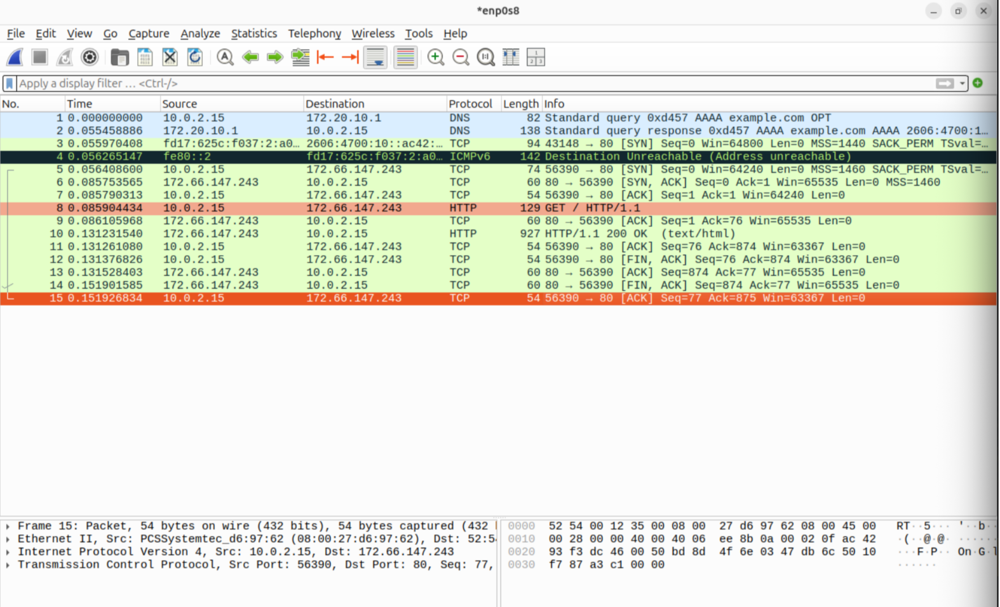
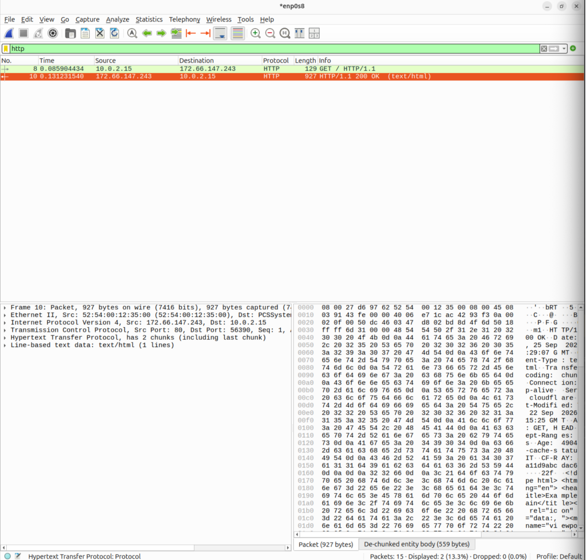
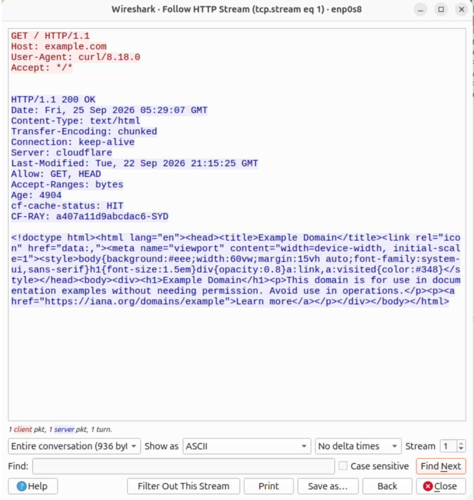

## Report: HTTP Plaintext Traffic Analysis

**Environment:** Ubuntu Server 26.04.1 LTS (ARM64), isolated VirtualBox lab VM (Ubuntu-Victim)
**Date:** 25 September 2026
**Tool:** Wireshark (capture on interface `enp0s8`)

### Summary

Captured and analyzed unencrypted HTTP traffic to demonstrate how plaintext protocols
expose full request and response content: including headers that can reveal
infrastructure details —> to anyone able to observe network traffic.

### Methodology

With a live Wireshark capture running on `enp0s8`, a plaintext HTTP request was
generated:

```
curl http://example.com
```



The corresponding TCP stream was located in the capture and reconstructed using
Wireshark's **Follow → HTTP Stream** feature.



### Findings

The reconstructed stream showed the complete, human-readable HTTP request and
response in cleartext — nothing was encrypted or obscured:

- The full HTTP request line, headers (including `Host`, `User-Agent`, `Accept`), and
  method were visible exactly as sent.
- The full HTTP response was visible, including status line, response headers, and
  body.
- Response headers disclosed infrastructure details, notably `Server: cloudflare` and
  a `CF-RAY` header, which reveal that the site is fronted by Cloudflare and can leak
  information useful for reconnaissance (e.g., CDN/edge identification).



### Security Implication

Because HTTP traffic is unencrypted, anyone positioned to observe the traffic (a
shared network, a compromised router, a malicious access point) can read requests and
responses in full — including any credentials, session tokens, or sensitive data sent
over HTTP rather than HTTPS. Response headers can also unintentionally disclose
backend infrastructure information useful to an attacker performing reconnaissance.

### Conclusion

This exercise demonstrates practical use of Wireshark's stream-following capability to
reconstruct and analyze plaintext application-layer traffic, and highlights concrete,
observable reasons why HTTPS (and minimizing informational response headers) matters
from a defensive standpoint.
