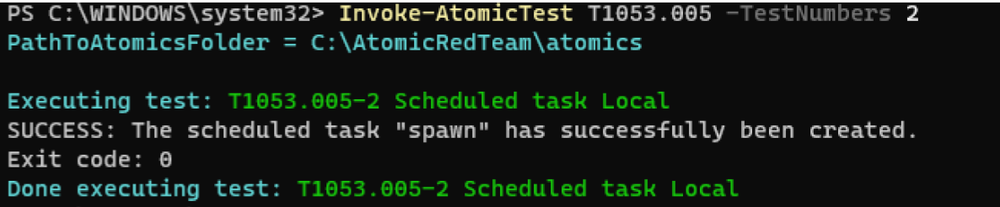
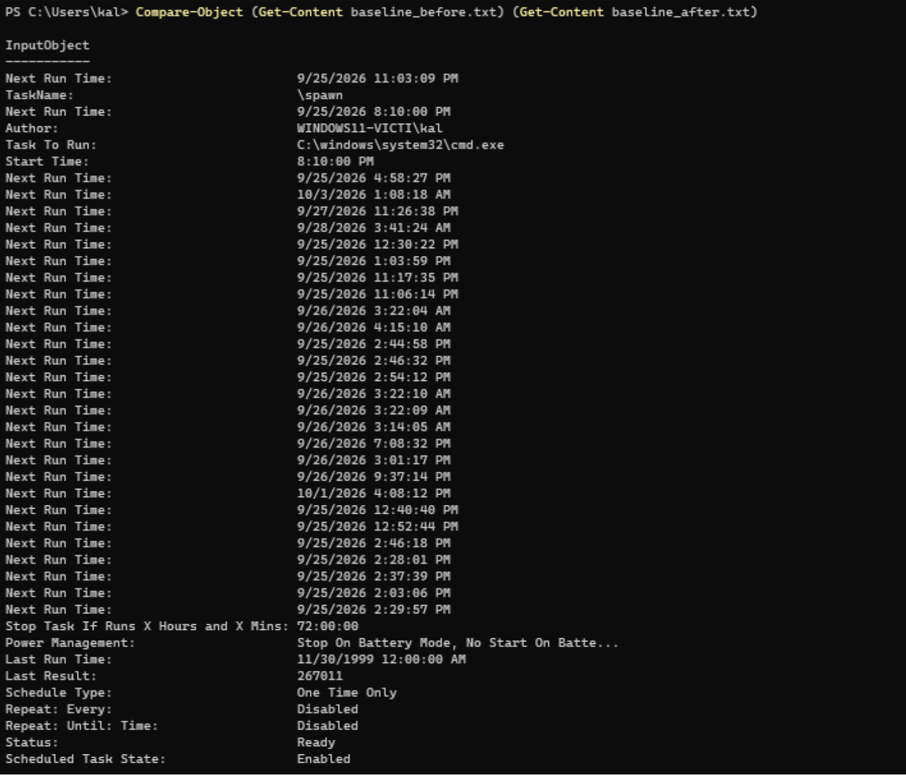
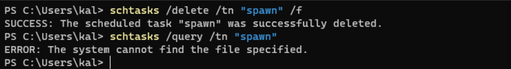

## Incident Report: T1053.005 - Scheduled Task/Job: Scheduled Task (Local)

**Environment:** Windows 11 Home (ARM64, build 10.0.26200), isolated VirtualBox lab VM
(Windows11-Victim)
**Date:** 25 September 2026
**Simulated by:** Invoke-AtomicRedTeam (Atomic Test T1053.005)

### Summary

Investigated a persistence mechanism established via a malicious Windows Scheduled
Task, discovered through full baseline comparison of all scheduled tasks rather than a
known task name, analysed, and remediated using native `schtasks` commands.

### Technique

T1053.005: Scheduled Task/Job: Scheduled Task (Persistence / Privilege Escalation).
Windows Scheduled Tasks can be used to execute a program on a recurring schedule or at
a specific trigger (logon, boot, etc.), providing a native mechanism for an attacker to
maintain persistence.

### Detection

A full baseline of scheduled tasks was captured before the technique executed:

```powershell
schtasks /query /fo LIST /v | Out-File schtasks_baseline_before.txt -Encoding UTF8
```

After running the Atomic Red Team test, the same command was run again and the two
outputs compared:



```powershell
schtasks /query /fo LIST /v | Out-File schtasks_baseline_after.txt -Encoding UTF8
Compare-Object (Get-Content schtasks_baseline_before.txt) (Get-Content schtasks_baseline_after.txt)
```



The comparison surfaced a new task named **"spawn"**, configured to run
`C:\windows\system32\cmd.exe`.

### Analysis

Independent of the task's name, the following properties support classifying this
task as suspicious:

- **Action:** the task's action directly launches `cmd.exe`, a command interpreter,
  not a purpose-built application. A scheduled task whose sole action is to spawn a
  shell is unusual for legitimate software, which typically schedules a specific
  maintenance or update executable, not a raw interpreter.
- **Newly introduced:** the task did not exist in the pre-execution baseline and
  appeared only after the simulated technique ran, which is what the before/after
  comparison was designed to surface regardless of what the task happened to be named.

### Eradication

```powershell
schtasks /delete /tn "spawn" /f
```

A genuine manual removal command was used rather than Atomic Red Team's own
`-Cleanup` flag, since a real attacker's planted task would not come with a built-in
removal tool.

### Verification

```powershell
schtasks /query /tn "spawn"
```

```
ERROR: The system cannot find the file specified.
```

This confirms the task was fully removed.



### MITRE ATT&CK Context / Conclusion

This exercise demonstrates detection of a Scheduled Task persistence mechanism through
full baseline comparison rather than prior knowledge of the task's name, technical
analysis of why its configured action was suspicious, and manual eradication and
verification using native `schtasks` commands.
