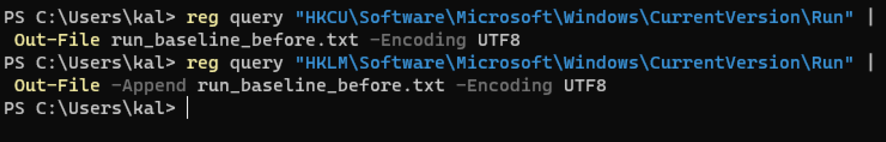
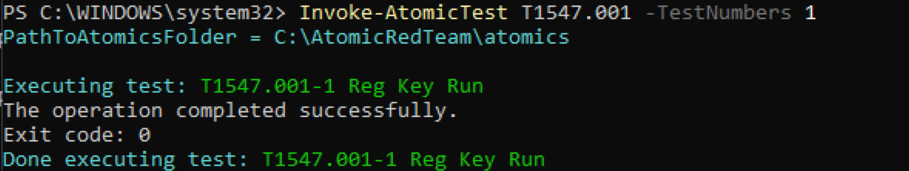
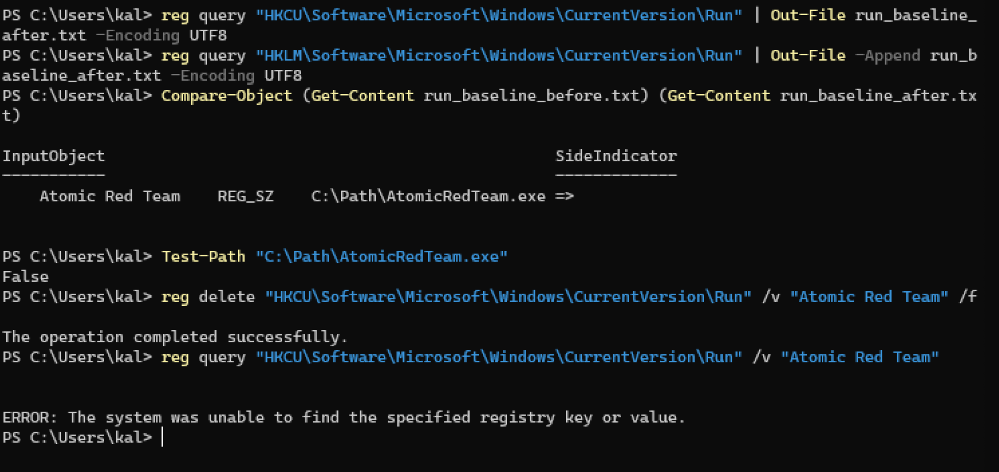

## Incident Report: T1547.001 – Boot or Logon Autostart Execution: Registry Run Keys

**Environment:** Windows 11 Home (ARM64, build 10.0.26200), isolated VirtualBox lab VM
(Windows11-Victim)
**Date:** 1 October 2026
**Simulated by:** Invoke-AtomicRedTeam (Atomic Test T1547.001-1)

### Summary

Investigated a persistence mechanism established via a Windows Registry Run key,
discovered through baseline comparison of the relevant registry locations rather than
a known value name, analyzed on name-independent technical criteria, and remediated
with a genuine manual registry command.

### Technique

T1547.001 – Boot or Logon Autostart Execution: Registry Run Keys / Startup Folder
(Persistence). Programs referenced in the `Run` keys under `HKCU` or `HKLM` execute
automatically at user logon (`HKCU`) or system boot (`HKLM`), making them a common
mechanism for establishing persistence.

### Detection

A baseline of both the current-user and machine-wide Run keys was captured before the
technique executed:

```powershell
cd ~
Import-Module "C:\AtomicRedTeam\invoke-atomicredteam\Invoke-AtomicRedTeam.psd1"
reg query "HKCU\Software\Microsoft\Windows\CurrentVersion\Run" | Out-File run_baseline_before.txt -Encoding UTF8
reg query "HKLM\Software\Microsoft\Windows\CurrentVersion\Run" | Out-File -Append run_baseline_before.txt -Encoding UTF8
```



The Atomic Red Team test was run, and the same two keys were captured again
immediately after:

```powershell
Invoke-AtomicTest T1547.001 -TestNumbers 1
reg query "HKCU\Software\Microsoft\Windows\CurrentVersion\Run" | Out-File run_baseline_after.txt -Encoding UTF8
reg query "HKLM\Software\Microsoft\Windows\CurrentVersion\Run" | Out-File -Append run_baseline_after.txt -Encoding UTF8
```



Comparing the two baselines surfaced exactly one new value:

```powershell
Compare-Object (Get-Content run_baseline_before.txt) (Get-Content run_baseline_after.txt)
```

```
Atomic Red Team    REG_SZ    C:\Path\AtomicRedTeam.exe
```

### Analysis

Independent of the value's name, the following properties support classifying this
entry as suspicious:

- **Referenced path:** `C:\Path\AtomicRedTeam.exe` is an implausible, non-standard
  install location — legitimate software is installed under paths like
  `C:\Program Files\` or `C:\Program Files (x86)\`, not a bare `C:\Path\`.
- **Binary existence:** checking whether the referenced executable actually exists
  confirmed it does not:

```powershell
Test-Path "C:\Path\AtomicRedTeam.exe"
```

```
False
```

A Run key pointing to a non-existent binary at an implausible path is a strong
indicator of a planted or leftover persistence artifact rather than legitimate
software.

### Eradication

```powershell
reg delete "HKCU\Software\Microsoft\Windows\CurrentVersion\Run" /v "Atomic Red Team" /f
```

A genuine manual removal command was used rather than Atomic Red Team's own
`-Cleanup` flag, since a real attacker's planted registry value would not come with a
built-in removal tool.

### Verification

```powershell
reg query "HKCU\Software\Microsoft\Windows\CurrentVersion\Run" /v "Atomic Red Team"
```

```
ERROR: The system was unable to find the specified registry key or value.
```

This confirms the value was fully removed.



### MITRE ATT&CK Context / Conclusion

This exercise demonstrates detection of a Registry Run key persistence mechanism
through baseline comparison rather than prior knowledge of the value's name, technical
analysis of why the referenced binary was suspicious (implausible path, non-existent
file), and full manual eradication and verification using native `reg` commands.
