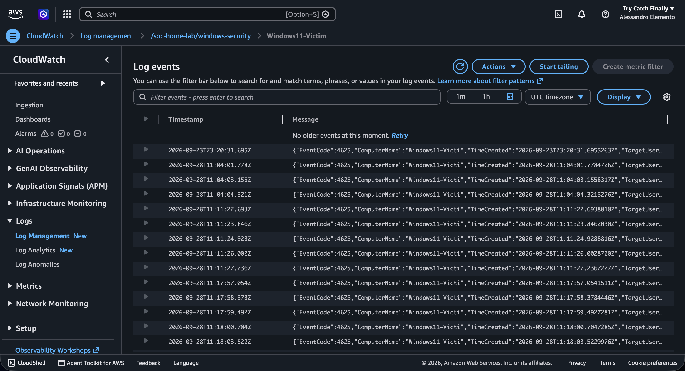
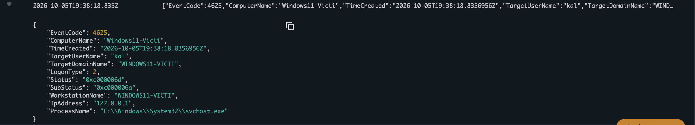
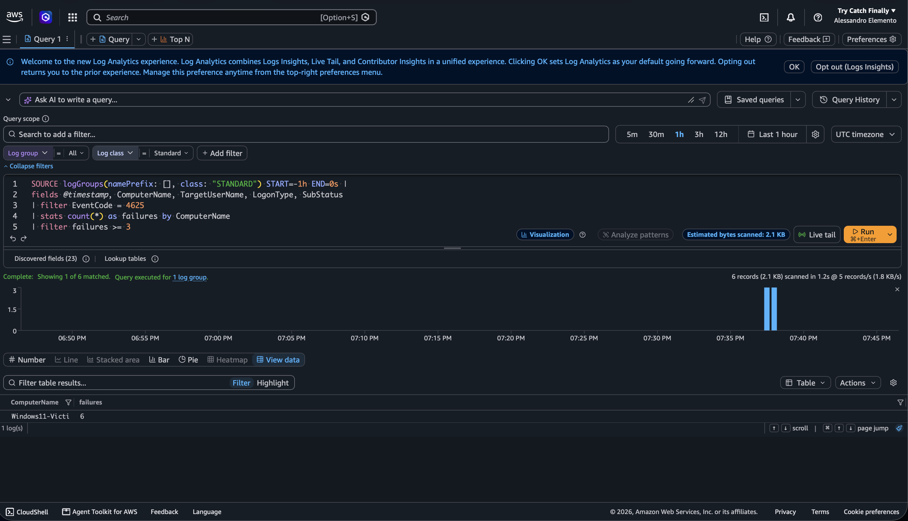
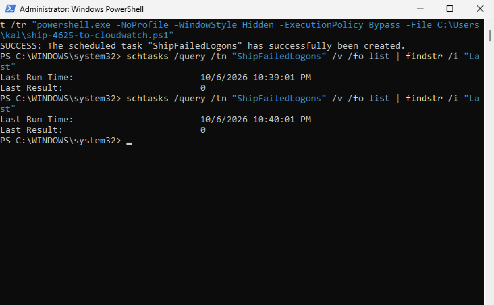
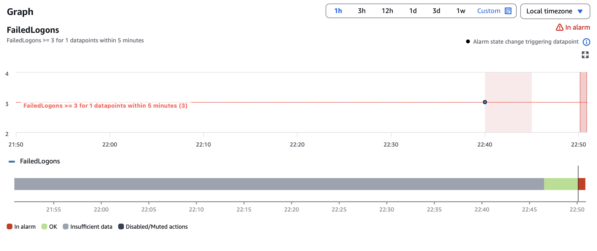
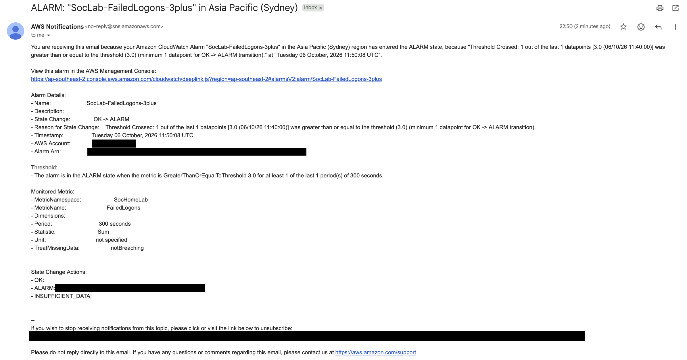
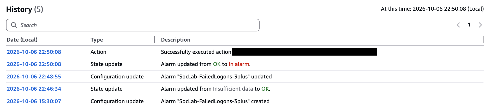

## Incident Report: Failed Logon Detection - Windows Events to AWS CloudWatch Logs, with an Alarm

**Environment:** Windows 11 Home (ARM64, build 10.0.26200), isolated VirtualBox lab VM
(Windows11-Victim), AWS region `ap-southeast-2` (Sydney)
**Date:** 6 October 2026
**Technique:** T1110.001: Brute Force - Password Guessing (Credential Access)
**Tools:** AWS CLI v2 (2.37.9), PowerShell, Windows Task Scheduler, Amazon CloudWatch Logs,
CloudWatch Logs Insights, CloudWatch metric filter and alarm, Amazon SNS

### Summary

Rebuilt the failed-logon detection from the Splunk report on AWS. Windows Security
Event ID 4625 records from the lab VM were shipped to a CloudWatch Logs log group by a
PowerShell script and the AWS CLI, which Windows Task Scheduler runs every minute. A Logs
Insights query reproduced the Splunk threshold logic (3 or more failures per host), and a
CloudWatch metric filter and alarm now email an alert when 3 or more failed logons land
within 5 minutes. Fresh failed logons were generated and confirmed to flow through the whole
chain to an alert email. Testing also caught a wrong comparison operator in my first alarm
(`>` instead of `>=`), which I corrected.

This was a small, single-host exercise to get hands-on with a cloud logging service. It is
not a production pipeline (see Limitations).

### AWS Setup

- **Account hygiene:** MFA enabled on the root user, which was used only for initial
  setup, with no root access keys created. Day-to-day access uses a separate IAM user.
- **IAM user:** `soc-lab-logger`, with a single customer-managed policy
  (`SocLabCloudWatchLogs`) scoped to log groups under `/soc-home-lab/*`. It allows
  creating and writing to log groups and streams, reading and querying them, and
  listing log groups. It grants nothing outside CloudWatch Logs.
- **Log group / stream:** `/soc-home-lab/windows-security` with a stream named
  `Windows11-Victim`.
- **Credentials:** configured on the VM with `aws configure` and verified with
  `aws sts get-caller-identity`.

### Data Source and Shipping Method

Event ID 4625 records are read from the Windows Security log with `Get-WinEvent` and
sent with `aws logs put-log-events` by
[`scripts/ship-4625-to-cloudwatch.ps1`](../../scripts/ship-4625-to-cloudwatch.ps1).

I used a script rather than the CloudWatch agent. I did not test the agent: I was unsure it
would run on Windows ARM64, and a script is something that can be reviewed in this
repository. The script:

- parses the event XML and sends one JSON message per event, so Logs Insights
  discovers fields such as `EventCode`, `LogonType` and `SubStatus` automatically;
- keeps a small state file with the timestamp of the last event shipped, so re-running
  it does not send duplicates;
- splits events into batches, because a single `PutLogEvents` request cannot span more
  than 24 hours (see below).

### Problems Encountered

- **`SignatureDoesNotMatch` on first use.** `aws sts get-caller-identity` failed. The
  likely cause was a mistyped secret access key, so I deleted the key, created a new
  one and re-ran `aws configure`. The call then returned the expected IAM user.
- **`PutLogEvents` 24-hour limit.** The first run, which backfilled old events, failed with
  `InvalidParameterException: The batch of log events in a single PutLogEvents request
  cannot span more than 24 hours`. Nothing had been stored, because the whole request
  is rejected. I added batching to the script. The re-run shipped 14 events in 2 batches.
- **Console lag.** Newly shipped events took a while to appear in the CloudWatch
  console, so this pipeline is near-real-time rather than instant.



### Test Execution

The workstation was locked and an incorrect password entered several times at about
06:38 Sydney time (19:38 UTC) on 6 October 2026, then the script was run. It shipped
6 events. That is more than the three attempts I intended, and I did not investigate
why Windows recorded additional 4625 events for the burst.

A representative event as stored in CloudWatch:

```json
{
  "EventCode": 4625,
  "ComputerName": "Windows11-Victi",
  "TimeCreated": "2026-10-05T19:38:18.8356956Z",
  "TargetUserName": "kal",
  "TargetDomainName": "WINDOWS11-VICTI",
  "LogonType": 2,
  "Status": "0xc000006d",
  "SubStatus": "0xc000006a",
  "WorkstationName": "WINDOWS11-VICTI",
  "IpAddress": "127.0.0.1",
  "ProcessName": "C:\\Windows\\System32\\svchost.exe"
}
```



### Detection Logic

The Splunk search was `stats count by ComputerName | where count >= 3`. The Logs Insights
equivalent, saved as
[`detections/failed-logon-threshold.logsinsights`](../../detections/failed-logon-threshold.logsinsights):

```
fields @timestamp, ComputerName, TargetUserName, LogonType, SubStatus
| filter EventCode = 4625
| stats count(*) as failures by ComputerName
| filter failures >= 3
```

Run over the last hour against the log group, it returned one row:

```
ComputerName        failures
Windows11-Victi     6
```



### Automation: Scheduled Shipping

So the pipeline runs without a person typing the command, the script is run once a minute
by Windows Task Scheduler (created from an elevated PowerShell):

```powershell
schtasks /create /tn "ShipFailedLogons" /sc minute /mo 1 /rl highest /tr "powershell.exe -NoProfile -WindowStyle Hidden -ExecutionPolicy Bypass -File C:\Users\kal\ship-4625-to-cloudwatch.ps1"
```

My first version of this task had no `-WindowStyle Hidden`, so it opened a visible
PowerShell window every minute. I kept closing those windows, which killed the runs and
left `Last Result: -1073741510` (`0xC000013A`, process terminated). That was my doing, not a
script fault. After recreating the task with a hidden window, consecutive runs reported
`Last Result: 0`. The task runs as my user and only while that user is logged in
("Interactive only"), because the AWS credentials live in that user's profile.



### Alerting: Metric Filter and Alarm

A metric filter on the log group turns each matching event into a metric data point:

- **Filter pattern:** `{ $.EventCode = 4625 }`
- **Metric:** namespace `SocHomeLab`, name `FailedLogons`, value 1, default value 0

An alarm then watches that metric:

- **Alarm:** `SocLab-FailedLogons-3plus`
- **Condition:** `Sum` of `FailedLogons` `>=` 3 within a 5-minute period, 1 out of 1 datapoints
- **Missing data:** treated as not breaching, so the alarm sits on OK when nothing happens
- **Action:** on entering ALARM, publish to an SNS topic (`soc-lab-alerts`) with my email
  address subscribed (the subscription had to be confirmed from a confirmation email first)

### Alarm Test and Tuning

At 22:43:45 Sydney time on 6 October 2026 I locked the workstation and entered an
incorrect password 3 times, then the correct one at 22:44:20. The scheduled task shipped the
events without any manual step, and the metric recorded a datapoint of 3 in the
11:40 UTC (22:40 Sydney) five-minute window.

The alarm did not fire at first. The condition I had configured was `FailedLogons > 3`
(strictly greater than) rather than `>= 3`, so a datapoint of exactly 3 stayed below the
threshold and the alarm remained on OK. Once I saw the threshold displayed as "> 3" in the
alarm details, I changed the operator to Greater/Equal and set missing-data handling to
"not breaching". The alarm re-evaluated the same real test data and entered ALARM at
11:50:08 UTC (22:50:08 Sydney), and the notification email arrived. I did not generate new
failed logons after the fix.

This is the same kind of mistake as the Splunk trigger condition in the earlier report: the
threshold logic looked reasonable but was off by one at the boundary, and only running real
events through it exposed that.

The alarm fired about six minutes after the failed logons. That delay comes from the 5-minute
alarm period plus shipping and evaluation time, so this is a minutes-scale detection rather
than the real-time alert Splunk provided.





The alarm's History tab records the sequence: created at 15:30, Insufficient data to OK at
22:46:34, my configuration fix at 22:48:55, then OK to In alarm at 22:50:08, followed by the
SNS notification action.



### Analysis

- **Logon Type 2** (Interactive) with **IpAddress 127.0.0.1** and `svchost.exe` as the
  calling process indicates a local console logon, not a remote network attack. This is
  the same conclusion as the Splunk report, now reached from data in CloudWatch.
- **Status `0xc000006d` with SubStatus `0xc000006a`** means the logon failed because
  the account exists but the password was wrong. A non-existent account would give a
  different SubStatus, so this tells an analyst the target username was valid.
- The burst was my own deliberate wrong-password attempts, so the correct classification
  is benign and expected. The exercise validated the pipeline and the query, not a
  real attack.

### Comparison with the Splunk Version

| | Splunk (earlier report) | CloudWatch (this report) |
|---|---|---|
| Collection | Local Event Log monitor input | PowerShell script + `put-log-events` |
| Detection | `stats count by ComputerName \| where count >= 3` | Same logic in Logs Insights QL |
| Alerting | Real-time alert, tuned and confirmed to fire | Metric filter plus alarm, email via SNS, tuned and confirmed to fire |
| Latency | Real time | About six minutes in the test (script every minute, 5-minute alarm period) |

### Limitations

- Shipping is a script on a one-minute Task Scheduler job, not a purpose-built agent. It
  only runs while the user is logged in. The CloudWatch agent would be the proper
  production route, but I did not test it.
- Detection latency is minutes, not real time, because of the 5-minute alarm period.
- Single host, a single log group and an IAM user with a long-term access key. A
  production setup would use roles with temporary credentials.
- The log group also holds older 4625 events from the earlier Splunk testing, which I
  backfilled while testing the script.

### Conclusion

This exercise covered setting up a scoped IAM user, shipping Windows security events to
CloudWatch Logs on a schedule, recreating a Splunk detection in Logs Insights, and
turning it into an alarm that sends an email alert. It also involved fixing real errors
along the way (credential signature failure, the 24-hour batch limit, a terminated
scheduled task, and a wrong alarm operator) and interpreting the event fields to
characterise the activity correctly.
