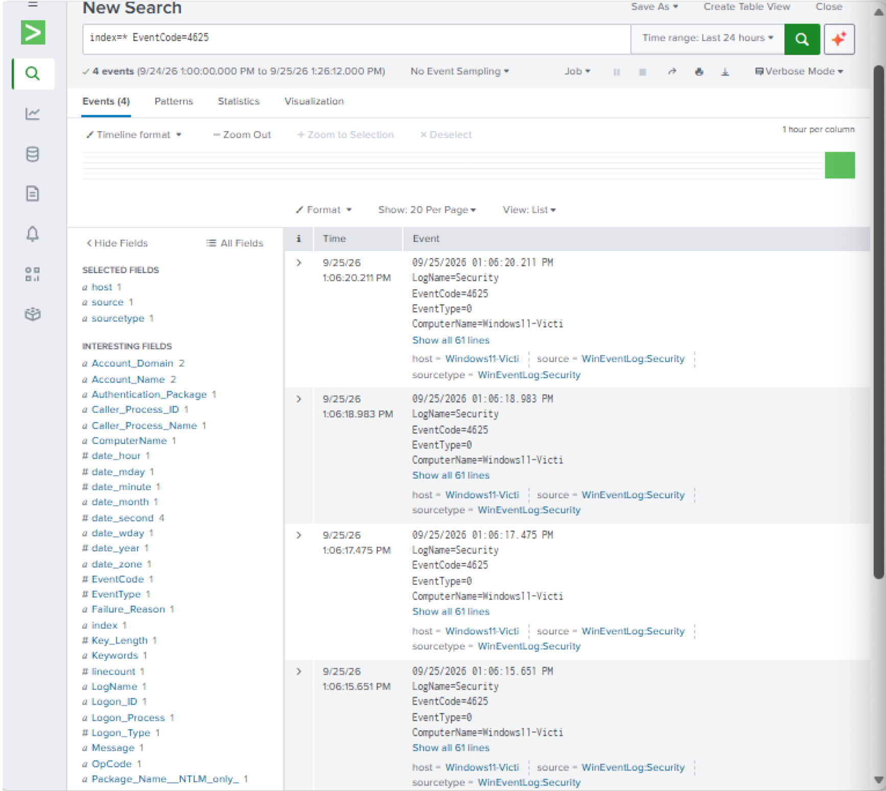
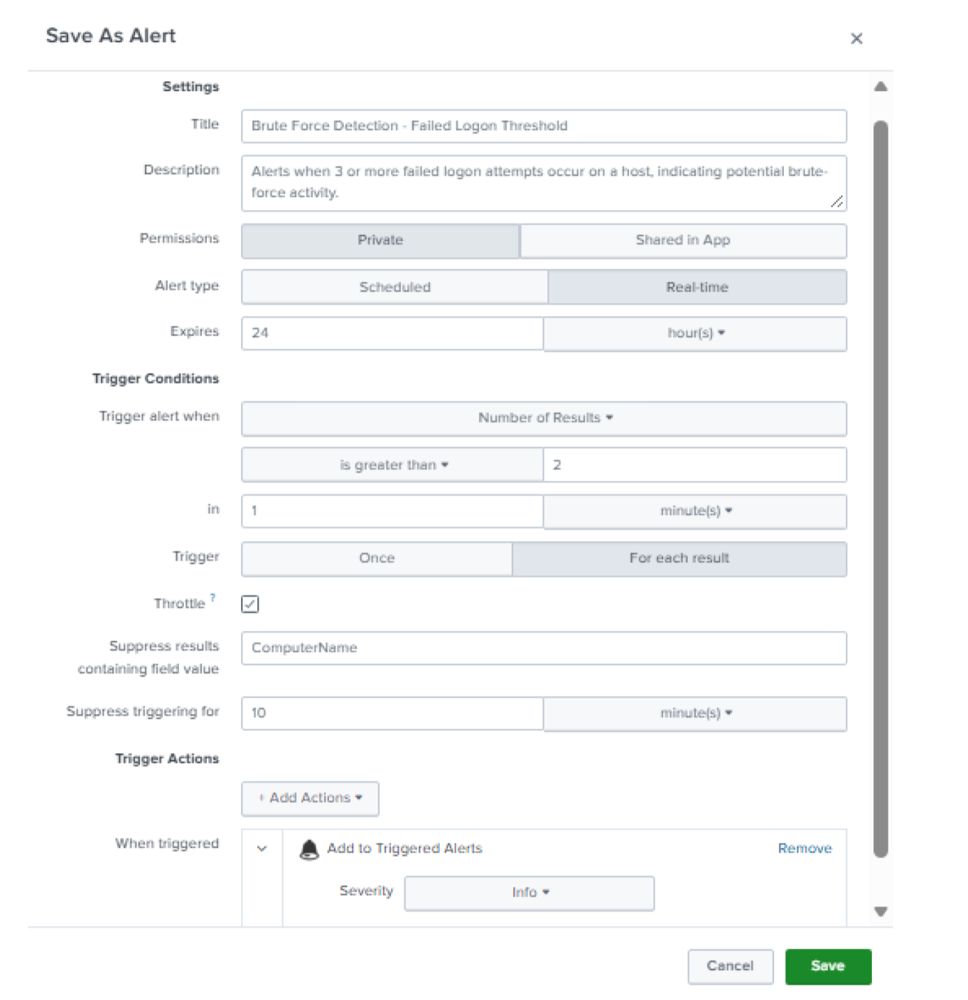

## Incident Report: Failed Logon Brute-Force Detection — SIEM Correlation & Alert Tuning

**Environment:** Windows 11 Home (ARM64, build 10.0.26200), isolated VirtualBox lab VM
(Windows11-Victim)
**Date:** 28 September 2026
**Technique:** T1110.001 – Brute Force: Password Guessing (Credential Access)
**Tool:** Splunk Enterprise 10.4.3 (build 4174a2deda5d)

### Summary

Built and tuned a real-time Splunk correlation search and alert to detect repeated
failed logon attempts (Event ID 4625) on a Windows host, generated genuine failed
logon events, and confirmed the alert fired correctly against real data — including
fixing a logic error in the original trigger condition.

### Technique

T1110.001 – Brute Force: Password Guessing. Repeated failed authentication attempts
against a single account or host within a short window are a classic indicator of a
password-guessing attack, and are a standard detection use case for a SIEM.

### Data Source

Splunk was configured with a **Local Event Log Collection** monitor input against the
Windows **Security** and **System** event logs on Windows11-Victim (Splunk itself was
installed on the Windows VM, as no ARM64 Linux build of Splunk exists).

Audit policy for logon events was confirmed enabled prior to testing:

```
auditpol /get /subcategory:"Logon"
```

Output confirmed **Success and Failure** auditing was active for the Logon
subcategory, meaning failed logon attempts (Event ID 4625) would be captured.

### Detection Logic

Correlation search used to identify hosts with 3 or more failed logons:

```spl
index=* EventCode=4625 | stats count by ComputerName, host | where count >= 3
```

This search only returns a result row once a given `ComputerName` has accumulated 3 or
more failed logon events — the threshold is encoded directly in the search itself via
`where count >= 3`.



### Alert Tuning — Correcting a Logic Error

The alert was initially configured with a Trigger Condition of **"Number of Results is
greater than 2."** This was incorrect: because the underlying search already filters
down to only the rows meeting the 3-failure threshold (`where count >= 3`), the number
of *results* returned is the number of distinct hosts/computers meeting that
threshold — not the failure count itself. A trigger condition of "greater than 2"
would require three or more **separate computers** to each independently accumulate 3+
failures within the same search window before the alert would ever fire, which is
unreachable in a single-host lab (and a much higher bar than intended in a
multi-host environment too).



The trigger condition was corrected to:

> **Number of Results is greater than 0, in a 1 minute window**

This correctly fires as soon as *any* host meets the 3-failure threshold already
encoded in the search, which matches the actual detection intent.

Final alert configuration:

- **Alert type:** Real-time
- **Trigger condition:** Number of Results is greater than 0, in 1 minute
- **Trigger:** For each result
- **Throttle:** enabled, suppressing on field `ComputerName` for 60 seconds, to avoid
  re-alerting on the same host repeatedly within the same short burst
- **Trigger Action:** Add to Triggered Alerts
- **Severity:** Low

### Test Execution & Confirmed Alert Fire

Three deliberate failed logon attempts were generated (locking the workstation and
entering an incorrect password). Splunk captured the corresponding Event ID 4625
records, and the correlation search returned:

```
ComputerName: Windows11-Victi    count: 3
```
for the window 9:17:01 PM – 9:18:01 PM.

The alert's **Trigger History** confirmed a real fire:

```
2026-09-28 21:18:01 AUS Eastern Standard Time
```

### Raw Event Detail (Analysis)

A representative raw event from this run:

```
09/28/2026 09:18:00.704 PM
EventCode=4625
ComputerName=Windows11-Victi
Logon Type: 2
Account For Which Logon Failed: kal (Account Domain: WINDOWS11-VICTI)
Failure Reason: Unknown user name or bad password
Status: 0xC000006D
Caller Process Name: C:\Windows\System32\svchost.exe
Workstation Name: WINDOWS11-VICTI
Source Network Address: 127.0.0.1
Source Port: 0
```

**Logon Type 2** (Interactive) combined with a **Source Network Address of
127.0.0.1** confirms these failed attempts originated from a local, interactive logon
at the machine's own console — not a remote network-based attack (which would show
Logon Type 3 and a real source IP). This distinction matters operationally: it means
this specific burst reflects local, benign failed logons (the lab's own deliberately
incorrect password entries) rather than an external brute-force attempt, even though
it still correctly exercised and validated the detection logic end-to-end.

### Conclusion

This exercise demonstrates building a working SIEM correlation search and alert from
raw Windows Security event data, identifying and correcting a logic error in the
alert's trigger condition (distinguishing "number of results" from the threshold
already encoded in the search), and using event log fields (Logon Type, Source Network
Address) to correctly characterize the nature of the detected activity rather than
assuming a worst-case interpretation.
